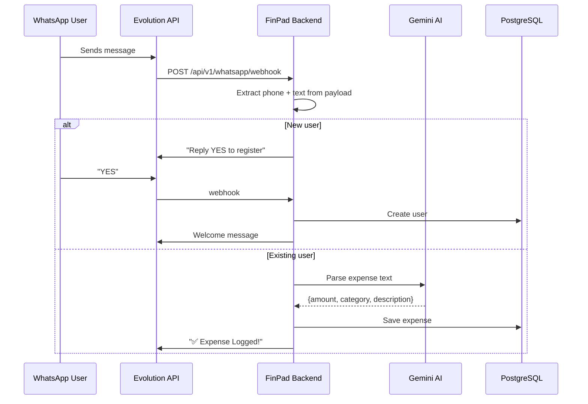

# FinPad Backend Review — WhatsApp Integration

## What Your App Does

**FinPad** is a personal finance tracker targeting Nigerian users. It has two interaction surfaces:

1. **Web Dashboard** (React/Vite) — OTP login via phone, CRUD expenses, dashboards, gamification
2. **WhatsApp Chatbot** (Evolution API) — users text natural-language expense messages (e.g. "Spent 2k on suya") and FinPad uses Gemini AI to parse them into structured expenses

### Key Backend Services

| Service | Purpose |
|---------|---------|
| `whatsapp_service.py` | Sends messages (OTP, reminders, summaries) via Evolution API |
| `otp_delivery.py` | WhatsApp-first OTP delivery with SMS (Termii) fallback |
| `notification_service.py` | Scheduled daily reminders & weekly summaries |
| `ai_service.py` | Gemini AI for natural-language expense parsing + receipt OCR |
| `whatsapp.py` (route) | Webhook endpoint that receives incoming WhatsApp messages and auto-registers users or logs expenses |

### Message Flow



---

## Infrastructure Status ✅

Your Docker containers are all running:

| Container | Status | Port |
|-----------|--------|------|
| `finpad_evolution` | ✅ Up | `8080` |
| `finpad_db` (Postgres) | ✅ Up | `5432` |
| `finpad_redis` | ✅ Up | `6379` |

Your Evolution API instance is **connected** to WhatsApp:

- **Instance name**: `findpad`
- **Connection status**: `open`  ✅
- **Owner JID**: `2347049593169@s.whatsapp.net`
- **Instance token**: `C53B417647D8-45B4-9750-F67A40C901FA`

---

## 🚨 Critical Issues Preventing WhatsApp Integration

### Issue 1: Wrong Instance Name in Config

Your Evolution API instance is named **`findpad`**, but your backend config defaults to **`finpad-main`**.

```diff
# In config.py line 38
- EVOLUTION_INSTANCE: str = "finpad-main"
+ EVOLUTION_INSTANCE: str = "findpad"
```

Every API call (`/message/sendText/{instance}`) uses this name. With the wrong name, **ALL outbound messages fail silently** (they return non-200, and the service just returns `False`).

### Issue 2: Wrong API Key in Config

Your Evolution API is running with `AUTHENTICATION_API_KEY=change-me`, but the **instance-level token** is `C53B417647D8-45B4-9750-F67A40C901FA`. 

In Evolution API v2, the `apikey` header in your HTTP calls must match either:
- The **global API key** (`AUTHENTICATION_API_KEY`), or
- The **instance token**

Your config defaults to `"change-me"` which is the global key. This should work, but let's verify and update the `.env` so it's explicit.

### Issue 3: No `.env` File Exists

> [!CAUTION]
> There is **no `.env` file** at the project root (where docker-compose reads from) and the `backend/.env` file is **empty**. This means:
> - The backend is running entirely on hardcoded defaults in `config.py`
> - The `EVOLUTION_INSTANCE` is stuck at `"finpad-main"` (wrong)
> - The `EVOLUTION_API_KEY` is stuck at `"change-me"` (may work but fragile)
> - `DATABASE_URL`, `REDIS_URL` etc. are using defaults (might work locally)

### Issue 4: No Webhook Configured in Evolution API

> [!WARNING]
> **This is the biggest blocker.** The Evolution API instance has **no webhook configured**. When someone sends a WhatsApp message to your number, Evolution API has no URL to forward it to, so your `/api/v1/whatsapp/webhook` endpoint **never gets called**.

I checked the webhook config for your `findpad` instance and got `null` — meaning no webhook is set.

You need to configure the webhook so Evolution API sends incoming messages to your FastAPI backend.

### Issue 5: `SERVER_URL` is `localhost` Inside Docker

The Evolution API container has `SERVER_URL=http://localhost:8080`. When you set up the webhook, the URL must point to your **backend from the perspective of the Evolution API container**. Since they're both in Docker, `localhost` inside the Evolution container refers to itself, not your backend.

---

## Fixes — In Priority Order

### Fix 1: Create the root `.env` file

This is needed for both docker-compose and for the backend to pick up correct values. You already have `.env.example` — we need a real `.env`.

### Fix 2: Set the correct `EVOLUTION_INSTANCE` and `EVOLUTION_API_KEY`

In the `.env`:
```env
EVOLUTION_INSTANCE=findpad
EVOLUTION_API_KEY=C53B417647D8-45B4-9750-F67A40C901FA
```

Or use the global key `change-me` if you prefer — both should work.

### Fix 3: Register the webhook with Evolution API

We need to call the Evolution API to register your backend's webhook URL. Since your backend runs on the **host** (not in Docker), the URL from Evolution's perspective would be `http://host.docker.internal:8000/api/v1/whatsapp/webhook`.

```bash
curl -X POST "http://localhost:8080/webhook/set/findpad" \
  -H "apikey: C53B417647D8-45B4-9750-F67A40C901FA" \
  -H "Content-Type: application/json" \
  -d '{
    "url": "http://host.docker.internal:8000/api/v1/whatsapp/webhook",
    "webhookByEvents": false,
    "webhookBase64": false,
    "events": ["MESSAGES_UPSERT"]
  }'
```

### Fix 4: Add error logging to WhatsApp service

Currently, `send_text` silently swallows errors and just returns `False`. This makes debugging impossible.

---

## Minor Issues (Non-Blocking)

| Issue | Location | Impact |
|-------|----------|--------|
| `_pending_registrations` is an in-memory `set` — resets on server restart | `whatsapp.py:25` | Users mid-registration lose state on restart. Use Redis instead. |
| `create_expense` does its own `db.commit()` inside the webhook flow, which also commits via `get_db()` dependency | `expense_service.py:32` | Double-commit — harmless but messy |
| No webhook signature validation | `whatsapp.py:192` | Anyone can POST to your webhook and fake messages |
| `_extract_phone_from_webhook` doesn't filter out `fromMe` messages | `whatsapp.py:28` | Your own outbound messages may trigger the bot to reply to itself |

---

## Ready to proceed?

I can apply all the critical fixes now:
1. ✅ Create proper `.env` files (root + backend)
2. ✅ Fix instance name and API key
3. ✅ Register the webhook with Evolution API
4. ✅ Add `fromMe` filtering to prevent self-replies
5. ✅ Add proper error logging to WhatsApp service

**Let me know if you want me to go ahead with the fixes, or if you have questions about any of the issues.**
